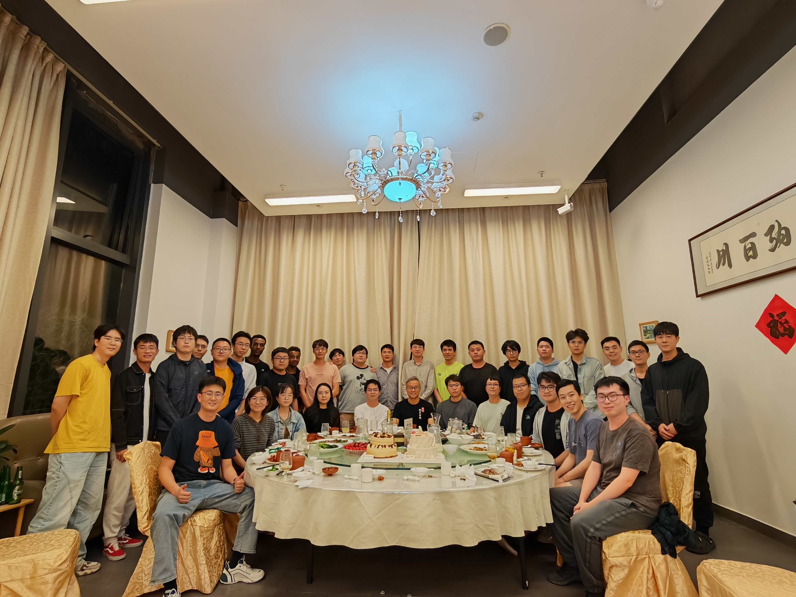

My name is Mengfei Zhao, a third-year student majoring in Intelligent Science within the Computer Science and Engineering Department. My supervisor is Ran Cheng, an associate professor at Hong Kong Polytechnic University. I will be participating in the UCSD 2025 Spring Extension Program.

Currently, I am exploring the intersection of pruning and optimization in Reinforcement Learning. After completing my undergraduate studies, I plan to pursue a Ph.D. I am the leader of the EMI NeuroEvolution subgroup, and my research fuels my desire to develop a systematic understanding of problems and offer innovative solutions.

Beyond AI, I am deeply intrigued by complex systems, mathematical logic, and philosophy. My goal is to immerse myself in the pursuit of knowledge, continuously seeking to understand the world in new ways. One of my favorite books is *Gödel, Escher, Bach: An Eternal Golden Braid* — it beautifully intertwines these interests.

I also enjoy connecting with others, drawing strength from meaningful relationships and interactions. These connections enrich my life, providing both a sense of belonging and a deeper understanding of the world around me.

*This is a photo from our EMI group dinner. I am in the white shirt in the center, and to my right is Professor Ran Cheng.*
